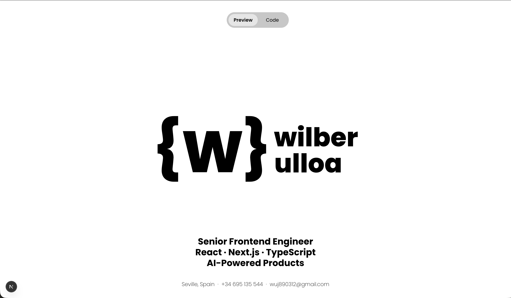
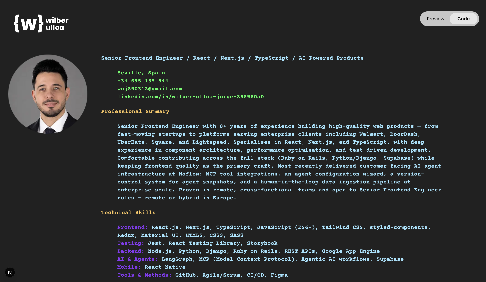

# {w} Wilber Ulloa — Interactive Resume

A scroll-driven, animated personal resume built with Next.js, GSAP, and Tailwind CSS. It presents the same content in two distinct modes toggled from the nav: a clean **Preview** view and a terminal-style **Code** view.

## Screenshots

### Preview Mode
The hero animates on scroll — logo and toggle slide to nav positions, headline scales up, then the about section pins and transitions into a contact form.



### Code Mode
Slides in from the right. Left panel stays fixed (profile photo); right panel scrolls independently through the full resume in a neon terminal aesthetic.



## Features

- **Scroll-driven animations** via GSAP ScrollTrigger — pinned sections, scrubbed timelines, and snap points
- **Two resume modes** — Preview (design-forward) and Code (terminal-style), toggled with a slide animation
- **Contact form reveal** — about text fades up, contact form rises from below the fold
- **Logo crossfade** — black → white as the dark About section enters the viewport
- **Independent panel scroll** in Code mode — image stays fixed, content panel scrolls without a visible scrollbar

## Tech Stack

- [Next.js](https://nextjs.org) (App Router)
- [GSAP](https://gsap.com) + ScrollTrigger
- [Tailwind CSS](https://tailwindcss.com)
- TypeScript

## Getting Started

```bash
pnpm install
pnpm dev
```

Open [http://localhost:3000](http://localhost:3000).

## Project Structure

```
app/
├── page.tsx                        # Root — all GSAP scroll animations live here
├── ui/components/
│   ├── preview/
│   │   ├── about.tsx               # About section (rendered by page.tsx)
│   │   ├── contact.tsx             # Contact form (animated in from below)
│   │   ├── nav-toggle.tsx          # Preview / Code toggle
│   │   └── navbar.tsx
│   └── code/
│       ├── code.tsx                # Terminal resume layout
│       ├── experience.tsx
│       └── education.tsx
└── data/
    └── constants.ts                # Work experience and education data
```
